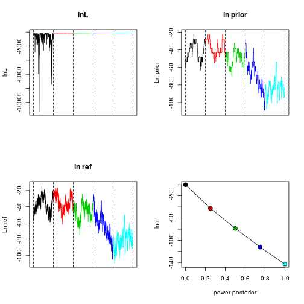
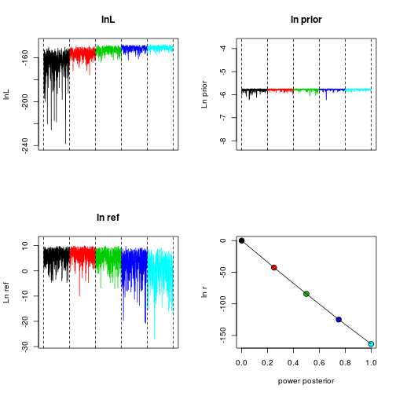
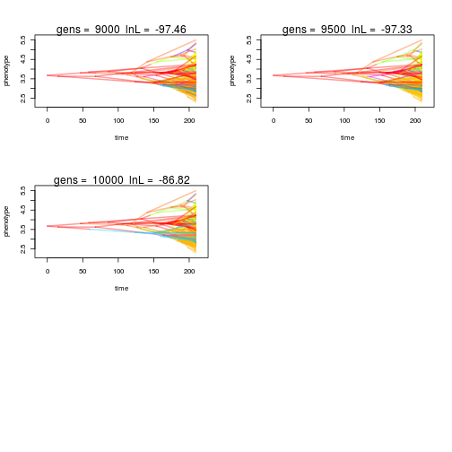
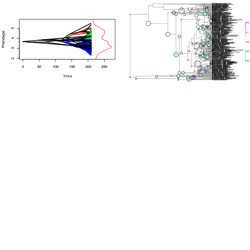
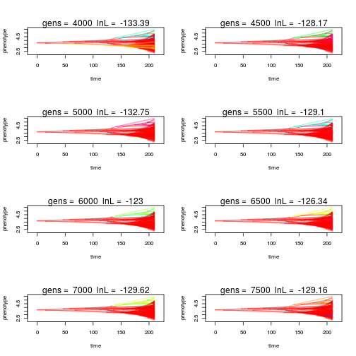

# Tutorial for the R package *bayou*
The purpose of *bayou* is to fit Bayesian models of adaptive evolution to phylogenetic comparative data. Specifically, *bayou* provides a flexible framework for fitting multi-optima Ornstein-Uhlenbeck models to phylogenetic comparative data. This tutorial demonstrates some of the options for running *bayou*.

## Reversible-jump MCMC over regime placement
In this example, we will fit a reversible-jump MCMC model to an included dataset (the Chelonia dataset of Jaffe et al. 2012). To start, we will specify a model in which no parameters are fixed. This will estimate the posterior of shift number, location and magnitude as well as all other parameters.

We begin by loading the package and data. We will also assume a constant standard error across all taxa. This can instead be a named vector with species-specific measurement error.

```r
require(devtools)
install_github("bayou", username="uyedaj")
```

```
## Installing github repo bayou/master from uyedaj
## Downloading master.zip from https://github.com/uyedaj/bayou/archive/master.zip
## Installing package from /tmp/RtmpFNOXjw/master.zip
## arguments 'minimized' and 'invisible' are for Windows only
## Installing bayou
## '/usr/lib/R/bin/R' --vanilla CMD INSTALL  \
##   '/tmp/RtmpFNOXjw/devtoolsfd772d78d49/bayou-master'  \
##   --library='/home/josef/R/x86_64-pc-linux-gnu-library/3.1'  \
##   --install-tests 
## 
## Reloading installed bayou
```

Now load the package and an example dataset


```r
require(bayou)
data(chelonia)
tree <- chelonia$phy
dat <- chelonia$dat
SE <- 0.05
```


### Defining a prior function
We now need to define prior function to set up our model. This can be the trickiest part. We will set half-cauchy priors for alpha and sigma^2, a normal prior for theta, a conditional Poisson for the number of shifts, and "dsb" controls how many shifts can be per branch (either 0, 1 or Inf) and the probability of a shift being on that branch. Since we have set bmax = 1 and prob = 1; we are specifying a model with a maximum of 1 shift per branch, and equal probability across all branches.

```r
prior <- make.prior(tree, dists=list(dalpha="dhalfcauchy", dsig2="dhalfcauchy",dsb="dsb", dk="cdpois", dtheta="dnorm"), param=list(dalpha=list(scale=1), dsig2=list(scale=1), dk=list(lambda=15, kmax=200), dsb=list(bmax=1,prob=1), dtheta=list(mean=mean(dat), sd=2)))
```

 
The figure produced gives a rough visual of the chosen prior distributions. 

### Running the MCMC
Now we are going to run the mcmc. We are going to output files to our working directory. If you want to specify another director, replace "getwd()" with the path of the directory. By default, *bayou outputs to the R temporary directory. We will run a relatively short chain of only 10,000 generations.

```r
par(mfrow=c(2,3))
fit1 <- bayou.mcmc(tree, dat, SE=SE, model="OU", prior, ngen=10000, new.dir=TRUE, plot.freq=2000, ticker.freq=1000)
```

```
## gen			lnL			prior			half.life			Vy			K			.alpha			birth.k			D0.slide			D1.slide			death.k			.sig2			.theta			U0.slide			U1.slide			U2.slide			
## 1000			-130.95			-104.84			1.95			0.19			17			0.37			0.03			0.88			0.57			0.79			0.35			0.65			1			0.75			0.77			
```

```
## 2000			-115.85			-84.32			9.67			0.23			13			0.39			0.03			0.9			0.33			0.71			0.35			0.56			0.94			0.46			0.46			
## 3000			-105.78			-90.39			11.63			0.21			14			0.39			0.02			0.91			0.36			0.77			0.34			0.59			0.92			0.37			0.38			
```

```
## 4000			-108.36			-63.68			12.64			0.24			9			0.38			0.02			0.91			0.39			0.71			0.33			0.56			0.93			0.39			0.33			
## 5000			-108.78			-69.23			9.99			0.23			10			0.37			0.02			0.91			0.39			0.71			0.33			0.56			0.94			0.4			0.33			
```

```
## 6000			-112.99			-94.64			8.34			0.23			15			0.36			0.02			0.9			0.38			0.69			0.33			0.55			0.94			0.41			0.29			
## 7000			-109.02			-89.57			8.63			0.2			14			0.36			0.02			0.9			0.39			0.69			0.34			0.54			0.94			0.41			0.3			
```

```
## 8000			-105.53			-104.5			14.76			0.24			17			0.36			0.02			0.88			0.37			0.7			0.34			0.54			0.93			0.41			0.31			
## 9000			-100.09			-89.04			6.6			0.19			14			0.36			0.02			0.87			0.36			0.69			0.33			0.54			0.94			0.41			0.3			
```

 

```
## 10000			-98.18			-90.47			4.96			0.18			14			0.35			0.02			0.87			0.35			0.67			0.33			0.54			0.94			0.4			0.29			
```

Most of the output is saved in a file, only an overview of the run is saved in *fit1*. 

```r
fit1
```

```
## bayou modelfit
## OU parameterization
## 
## Results are stored in directory
## /tmp/RtmpFNOXjw/GBSWONIDUF/bayou.* 
## To load results, use 'load.bayou(bayouFit)'
## 
## 10000  generations were run with the following acceptance probabilities:
##   .alpha  birth.k D0.slide D1.slide  death.k    .sig2   .theta U0.slide 
##     0.35     0.02     0.87     0.35     0.67     0.33     0.54     0.94 
## U1.slide U2.slide 
##     0.40     0.29 
##  Total number of proposals of each type:
##   .alpha  birth.k D0.slide D1.slide  death.k    .sig2   .theta U0.slide 
##     1825     4404      171      278      132      901     1827      174 
## U1.slide U2.slide 
##      134      154
```

We can load the actual chains by running the following code:

```r
chain <- load.bayou(fit1, save.Rdata=FALSE, cleanup=TRUE)
```

```
## deleting temporary directory /tmp/RtmpFNOXjw/GBSWONIDUF/
```

```r
chain <- set.burnin(chain, 0.3)
```

We can return a summary of our MCMC results by summarizing the chain. Notice the very small effective sample sizes for parameters for only 10,000 generations, need to get more like 100 for each by running the MCMC for more generations.

```r
out <- summary(chain)
```

```
## bayou MCMC chain: 10000 generations
## 1000 samples, first 300 samples discarded as burnin
## 
## 
## Summary statistics for parameters:
##                 Mean       SD  Naive SE Time-series SE Effective Size
## lnL       -106.84392  6.48801 0.2450489       2.551911          6.464
## prior      -80.90657 14.32649 0.5411042       7.760487          3.408
## alpha        0.08805  0.04623 0.0017459       0.016947          7.440
## sig2         0.03542  0.01308 0.0004939       0.004438          8.684
## k           12.32525  2.79383 0.1055215       1.531948          3.326
## ntheta      13.32525  2.79383 0.1055215       1.531948          3.326
## root         3.66243  0.14732 0.0055644       0.057626          6.536
## all theta    3.81699  0.97045        NA             NA             NA
## 
## 
## Branches with posterior probabilities higher than 0.1:
##         pp magnitude.of.theta2 naive.SE.of.theta2 rel.location
## 372 1.0000              4.2390           0.006837      0.87743
## 408 1.0000              4.9207           0.007625      1.88792
## 45  0.9971              4.7575           0.010596      0.38773
## 252 0.6305              4.1782           0.012988      0.69344
## 411 0.4365              3.1748           0.002791      1.50395
## 205 0.3566              3.8649           0.062507      0.46751
## 343 0.3238              4.6827           0.082687      4.21870
## 300 0.2882              3.9898           0.019234      0.23226
## 345 0.2668              3.8027           0.036035     46.21276
## 275 0.2639              3.5182           0.035001      1.49455
## 409 0.2582              3.1584           0.005967      1.52039
## 436 0.2511              2.4718           0.025521      0.33380
## 116 0.2454              3.7408           0.059518     22.48662
## 128 0.2154              4.1798           0.053491      0.46821
## 437 0.1983              2.6601           0.027100      1.77667
## 219 0.1897              2.8449           0.010284      0.49163
## 346 0.1812              4.5171           0.051981      6.25345
## 120 0.1669              3.9567           0.050336      1.59313
## 406 0.1569              3.1347           0.002793      0.06200
## 57  0.1469              3.4949           0.048128      1.56026
## 87  0.1412              4.1496           0.044801      0.07214
## 112 0.1384              5.5517           0.121080      0.13680
## 352 0.1369              2.7742           0.024286      0.83147
## 433 0.1355              2.3004           0.038097      0.23196
## 293 0.1312              0.8025           0.127548     33.65490
## 277 0.1298              3.0654           0.038383      0.52618
## 441 0.1298              2.9715           0.020797      0.41635
## 269 0.1255              3.6292           0.118576      2.72605
## 403 0.1227              4.1600           0.018433      1.04076
## 241 0.1098              3.9177           0.043316      0.43056
## 218 0.1041              3.0663           0.044644      0.40202
## 297 0.1027              2.7194           0.048261      9.20340
## 217 0.1013              3.0532           0.032852      0.92169
## 294 0.1013              2.8140           0.060062      0.83293
```

We can visualize the chains by viewing traces for each parameter using the plotting utilities of the R package coda:

```r
plot(chain)
```

  

We can view where there are shifts of high probability.

```r
par(mfrow=c(1,1))
plotSimmap.mcmc(tree, chain, burnin=0.3, circle=TRUE,fsize=0.4)
```

 

And we can view the density of phenotypic optima and location of highly supported shifts on the phenogram. Here we show all shifts with posterior probabilities greater than *pp.cutoff = 0.3*. 

```r
phenogram.density(tree, dat, chain=chain, burnin=0.3, pp.cutoff=0.3)
```

 

### Diagnosing Convergence
It is useful to run two chains with independent starting positions. By default, *bayou* simulates starting parameters from the prior distribution. We will re-run the analysis here to obtain an independent chain.

```r
fit2 <- bayou.mcmc(tree, dat, SE=SE, model="OU", prior, ngen=10000, new.dir=TRUE, plot.freq=NULL, ticker.freq=1000)
```

```
## gen			lnL			prior			half.life			Vy			K			.alpha			birth.k			D0.slide			D1.slide			death.k			.sig2			.theta			U0.slide			U1.slide			U2.slide			
## 1000			-164			-96.99			0.76			0.25			15			0.32			0.03			0.88			0.21			0.91			0.39			0.66			1			0.54			0.62			
## 2000			-116.32			-83.73			14.63			0.26			13			0.35			0.03			0.93			0.27			0.86			0.38			0.59			0.95			0.45			0.61			
## 3000			-122.39			-129.29			10.66			0.28			22			0.34			0.03			0.88			0.31			0.81			0.32			0.59			0.96			0.47			0.56			
## 4000			-109.4			-105.17			14.97			0.25			17			0.34			0.03			0.88			0.29			0.81			0.31			0.61			0.91			0.52			0.52			
## 5000			-105.69			-98.77			6.22			0.18			16			0.33			0.03			0.9			0.32			0.78			0.31			0.6			0.9			0.51			0.52			
## 6000			-106.17			-88.99			9.86			0.23			14			0.33			0.03			0.89			0.33			0.78			0.33			0.59			0.92			0.53			0.48			
## 7000			-119.03			-63.94			7.77			0.23			9			0.33			0.02			0.89			0.31			0.77			0.33			0.58			0.93			0.51			0.43			
## 8000			-109.34			-75.08			12.97			0.23			11			0.32			0.03			0.87			0.3			0.78			0.33			0.58			0.93			0.49			0.39			
## 9000			-108.58			-63.56			9.04			0.19			9			0.32			0.03			0.86			0.29			0.79			0.33			0.58			0.94			0.47			0.37			
## 10000			-110.32			-63.46			14.7			0.25			9			0.32			0.02			0.85			0.29			0.78			0.33			0.57			0.94			0.46			0.36			
```

```r
chain2 <- load.bayou(fit2, save.Rdata=FALSE, cleanup=FALSE)
chain2 <- set.burnin(chain2, 0.3)
```

Now we can compare chains to see if the parameters have converged using Gelman and Rubin's R statistic. Values close to 1 indicate chains have converged (these two chains will not have converged in only 10,000 generations).

```r
RlnL <- gelman.R("lnL", chain1=chain, chain2=chain2, plot=TRUE, type="n", ylim=c(0.9, 2))
```

 

```r
Ralpha <- gelman.R("alpha", chain1=chain, chain2=chain2, plot=TRUE, type="n", ylim=c(0.9, 2))
```

 

```r
Rsig2 <- gelman.R("sig2", chain1=chain, chain2=chain2, plot=TRUE, type="n", ylim=c(0.9, 2))
```

 

Of particular interest to inference are the branch posterior probabilities, we can plot these to see if the two chains converged on similar answers. If the runs have converged, points should fall along the y=x line.

```r
L1 <- Lposterior(chain,tree, burnin=0.3)
L2 <- Lposterior(chain2,tree, burnin=0.3)
plot(L1$pp,L2$pp, xlim=c(0,1), ylim=c(0,1), xlab="Chain 1", ylab="Chain 2")
curve(1*x, add=TRUE, lty=2)
```

 

We can also combine chains:

```r
chains <- combine.chains(chain, chain2, burnin.prop=0.3)
chains <- set.burnin(chains, 0)
```

### Estimating marginal likelihoods
To compare models, we want to estimate the marginal likelihood, which is performed using the stepping stone algorithm in *bayou*. The method first estimates a reference function by fitting a series of curves to the posterior of an MCMC chain. The function *steppingstone* will output a graphic showing the best-fitting density functions overlaying the posterior distribution. Then the stepping stone MCMC's are run for every value in the vector *Bk*, corresponding to each value of the power posterior function ranging from the reference function (*Bk = 0*) to the posterior (*Bk = 1*). 
To speed things up, you can specify multiple cores by registering a parallel backend for the \code{foreach} package.

```r
#require(doParallel)
#registerDoParallel(cores=5)
ss <- steppingstone(Bk=seq(0,1,length.out=5), chains, tree, dat, SE=SE, prior=prior, new.dir=TRUE, ngen=10000, parallel=FALSE) #set parallel to TRUE if desired.
```

```
## Making power posterior function from provided mcmc chain...
```

 

```
## Running mcmc chains...
## Bk_k			gen			lnL			prior			ref			half.life			Vy			K			.alpha			birth.k			D0.slide			D1.slide			death.k			.sig2			.theta			U0.slide			U1.slide			U2.slide			
## 0			1000			-507.05			-55.06			-47.62			13.11			0.28			7			0.75			0			1			1			1			0.53			0.72			1			1			1			
## 0			2000			-147.63			-37.89			-27.79			16.69			0.31			4			0.76			0.01			1			1			1			0.57			0.75			1			1			1			
## 0			3000			-171.82			-37.83			-28.98			16.12			0.17			4			0.78			0.01			1			1			1			0.59			0.76			1			1			1			
## 0			4000			-447.84			-53.84			-44.73			9.96			0.23			7			0.79			0.01			1			1			1			0.61			0.78			1			1			1			
## 0			5000			-640.64			-32.88			-23.32			8.28			0.24			3			0.79			0.01			1			1			1			1			0.62			0.78			1			1			1			
## 0			6000			-1385.06			-27.87			-20.9			4.46			0.13			2			0.8			0.01			1			1			1			1			0.64			0.79			1			1			1			
## 0			7000			-249.68			-43.62			-33.96			8.99			0.2			5			0.79			0.01			1			1			1			1			0.65			0.79			1			1			1			
## 0			8000			-1630.45			-28.01			-19			8.71			0.13			2			0.78			0.01			1			1			1			1			0.65			0.8			1			1			1			
## 0			9000			-193.26			-33.15			-23.31			12.74			0.28			3			0.78			0.01			1			1			1			1			0.66			0.8			1			1			1			
## 0			10000			-145.91			-27.78			-18.76			22.75			0.48			2			0.79			0.01			1			1			1			1			0.65			0.8			1			1			1			
## Bk_k			gen			lnL			prior			ref			half.life			Vy			K			.alpha			birth.k			D0.slide			D1.slide			death.k			.sig2			.theta			U0.slide			U1.slide			U2.slide			
## 0.25			1000			-145.09			-82.86			-83.31			23.97			0.53			12			0.56			0.01			1			0.63			1			0.63			0.74			1			1			1			
## 0.25			2000			-145.37			-49.24			-44.17			36.84			0.68			6			0.56			0.01			0.98			0.78			1			0.61			0.74			0.97			1			0.93			
## 0.25			3000			-152.21			-43.08			-33.53			22.55			0.53			5			0.55			0.01			0.98			0.8			1			0.56			0.73			0.99			1			0.93			
## 0.25			4000			-149.79			-49.74			-44.17			19.82			0.31			6			0.56			0.01			0.98			0.78			1			0.56			0.72			0.99			1			0.94			
## 0.25			5000			-140.41			-37.86			-30.85			29.31			0.33			4			0.56			0.01			0.97			0.76			1			0.57			0.72			0.99			1			0.95			
## 0.25			6000			-140.78			-37.99			-31.67			29.72			0.35			4			0.54			0.01			0.98			0.77			1			0.57			0.71			0.99			0.98			0.94			
## 0.25			7000			-150.96			-22.64			-13.21			17.54			0.31			1			0.54			0.01			0.97			0.8			1			0.56			0.7			0.99			0.96			0.95			
## 0.25			8000			-142.98			-22.54			-13.5			20.02			0.33			1			0.54			0.01			0.97			0.8			1			0.55			0.66			0.99			0.96			0.96			
## 0.25			9000			-146.92			-32.7			-23.05			20.61			0.3			3			0.55			0.01			0.97			0.8			1			0.55			0.66			0.99			0.96			0.96			
## 0.25			10000			-144.17			-42.86			-31.99			17.19			0.36			5			0.55			0.01			0.97			0.8			1			0.55			0.66			0.99			0.96			0.96			
## Bk_k			gen			lnL			prior			ref			half.life			Vy			K			.alpha			birth.k			D0.slide			D1.slide			death.k			.sig2			.theta			U0.slide			U1.slide			U2.slide			
## 0.5			1000			-141.47			-96.22			-92.52			35.71			0.51			15			0.52			0.02			0.96			0.65			1			0.44			0.69			1			0.67			0.88			
## 0.5			2000			-130.66			-91.18			-87.02			33.77			0.46			14			0.47			0.02			0.98			0.71			1			0			0.43			0.72			0.98			0.68			0.78			
## 0.5			3000			-135.18			-69.47			-60.49			15.1			0.32			10			0.48			0.02			0.97			0.73			1			0			0.45			0.71			0.99			0.72			0.69			
## 0.5			4000			-140.83			-58.18			-47.51			27.89			0.5			8			0.49			0.02			0.97			0.72			1			0			0.46			0.69			0.98			0.68			0.72			
## 0.5			5000			-136.85			-64.08			-55.02			24.8			0.4			9			0.49			0.01			0.93			0.74			1			0			0.45			0.7			0.98			0.74			0.81			
## 0.5			6000			-134.61			-83.98			-73.48			26.88			0.37			13			0.49			0.02			0.94			0.74			1			0			0.44			0.71			0.98			0.77			0.79			
## 0.5			7000			-142.31			-55.07			-54.21			45.22			0.7			7			0.49			0.02			0.93			0.73			1			0			0.44			0.72			0.98			0.75			0.76			
## 0.5			8000			-139.81			-59.4			-51.23			19.89			0.41			8			0.48			0.02			0.94			0.74			1			0			0.43			0.72			0.96			0.79			0.75			
## 0.5			9000			-140.08			-53.33			-45.24			32.85			0.46			7			0.48			0.02			0.95			0.72			1			0			0.43			0.72			0.97			0.78			0.74			
## 0.5			10000			-133.18			-34.47			-31.3			25.48			0.31			3			0.48			0.01			0.94			0.68			1			0			0.44			0.72			0.97			0.76			0.74			
## Bk_k			gen			lnL			prior			ref			half.life			Vy			K			.alpha			birth.k			D0.slide			D1.slide			death.k			.sig2			.theta			U0.slide			U1.slide			U2.slide			
## 0.75			1000			-134.09			-55.13			-49.83			19.2			0.29			7			0.38			0.02			0.93			0.62			1			0.53			0.69			1			0.62			0.33			
## 0.75			2000			-126.86			-55.01			-49.87			25.35			0.43			7			0.37			0.01			0.9			0.45			1			0.43			0.69			0.92			0.57			0.32			
## 0.75			3000			-132.14			-76.7			-73.03			21.35			0.34			11			0.38			0.02			0.89			0.48			0.95			0.39			0.7			0.95			0.55			0.36			
## 0.75			4000			-131.34			-65.51			-61.55			25.36			0.35			9			0.4			0.02			0.86			0.52			0.93			0.39			0.71			0.96			0.62			0.42			
## 0.75			5000			-126.2			-70.33			-65.86			23.01			0.25			10			0.42			0.02			0.85			0.51			0.92			0.38			0.71			0.97			0.6			0.44			
## 0.75			6000			-146.83			-43.74			-44.21			66.75			0.86			5			0.42			0.02			0.86			0.48			0.94			0.37			0.72			0.97			0.58			0.5			
## 0.75			7000			-136.33			-63.82			-55.54			28.4			0.4			9			0.43			0.02			0.88			0.47			0.94			0.38			0.72			0.97			0.64			0.57			
## 0.75			8000			-142.41			-37.82			-28.96			28.03			0.49			4			0.42			0.02			0.88			0.49			0.95			0.38			0.72			0.96			0.68			0.6			
## 0.75			9000			-137.35			-54.23			-49.65			34.22			0.44			7			0.43			0.02			0.89			0.5			0.96			0.37			0.72			0.96			0.7			0.63			
## 0.75			10000			-140.13			-69.56			-63.32			30.45			0.46			10			0.43			0.02			0.9			0.49			0.96			0.36			0.72			0.97			0.7			0.64			
## Bk_k			gen			lnL			prior			ref			half.life			Vy			K			.alpha			birth.k			D0.slide			D1.slide			death.k			.sig2			.theta			U0.slide			U1.slide			U2.slide			
## 1			1000			-118.53			-94.81			-85.89			6.23			0.24			15			0.3			0.04			0.95			0.3			0.62			0.38			0.43			0.96			0.57			0.56			
## 1			2000			-96.05			-124.44			-107.47			9.47			0.22			21			0.33			0.04			0.9			0.36			0.72			0.38			0.46			0.95			0.44			0.55			
## 1			3000			-93.57			-104.6			-91.92			5.76			0.16			17			0.33			0.03			0.92			0.37			0.74			0.36			0.47			0.95			0.42			0.41			
## 1			4000			-91.13			-83.79			-70.59			7.75			0.18			13			0.33			0.03			0.9			0.34			0.68			0.37			0.46			0.94			0.43			0.35			
## 1			5000			-100.05			-103.91			-89.17			7.28			0.17			17			0.32			0.03			0.89			0.33			0.67			0.37			0.47			0.95			0.4			0.31			
## 1			6000			-106.69			-73.66			-62.11			7.21			0.22			11			0.31			0.03			0.86			0.34			0.66			0.35			0.46			0.95			0.39			0.29			
## 1			7000			-104.22			-96.64			-100.28			3.03			0.16			15			0.31			0.02			0.86			0.33			0.64			0.34			0.46			0.96			0.37			0.26			
## 1			8000			-99.26			-101.09			-96.89			5.84			0.22			16			0.32			0.02			0.85			0.31			0.63			0.33			0.47			0.96			0.36			0.26			
## 1			9000			-95.41			-94.41			-84.47			5.27			0.15			15			0.32			0.02			0.85			0.3			0.65			0.33			0.47			0.96			0.35			0.28			
## 1			10000			-96.03			-89.51			-81.08			4.45			0.18			14			0.32			0.02			0.86			0.31			0.65			0.33			0.47			0.94			0.37			0.3			
## Loading mcmc chains...
```

```r
ss
```

```
## Stepping stone estimation of marginal likelihood
## Marginal Likelihood:
## [1] -145.2
## A total of 5 power posteriors were run along the sequence: 0		0.25		0.5		0.75		1
## lnr_k -40.34 -36.7 -34.58 -33.63
```

```r
ss <- set.burnin(ss, 0.3)
```

Plotting the stepping stone object will give you an idea of convergence for each of the MCMC's by providing a trace of the lnL, ln prior, and reference function as well as the estimated marginal likelihood at each step.

```r
plot(ss)
```

 

## Fitting models with fixed parameters
*bayou* also allows the user to fit models with fixed parameters, including non-reversible jump models. A helpful utility for setting up fixed hypotheses is the function *identifyBranches*. First, we set up some starting parameters.

```r
startpar <- list(alpha=1, sig2=1, k=2, ntheta=3, theta=c(4,5,6))
```

Then we use *identifyBranches()* to specify the location of shifts by clicking on them. f

```r
fixed.hypothesis <- identifyBranches(tree, startpar$k)
```


```r
startpar$sb <- fixed.hypothesis$sb
startpar$t2 <- 2:startpar$ntheta
startpar$loc <- fixed.hypothesis$loc
plotBayoupars(startpar, tree, fsize=0.5)
```

```
## no colors provided. using the following legend:
##        1        2        3 
##  "black"    "red" "green3"
```

 

This is a good time to explain how *bayou* stores parameters. *bayou* takes parameter values as a list of values corresponding to the model. For the standard OU model, these parameters are:

```r
startpar
```

```
## $alpha
## [1] 1
## 
## $sig2
## [1] 1
## 
## $k
## [1] 2
## 
## $ntheta
## [1] 3
## 
## $theta
## [1] 4 5 6
## 
## $sb
## [1] 411 409
## 
## $t2
## [1] 2 3
## 
## $loc
## [1] 24  8
```

*k* is the number of shifts and *ntheta* is the number of phenotypic optima. *theta* is a vector of optima values equal in length to *ntheta*, with *theta*[1] corresponding to the root value and optimum. 
*sb* specifies the branch locations of shifts, and is equal in length to *k*. Note that because this vector specifies branches numbers, *bayou* always works with postorder trees. The vectors *loc* and *t2* are equal in length to *sb*, and specify the location of the shift on the branch (in distance from the starting point of that branch) and the identity of the optima *after the shift* (which corresponds to the *i*th element of the *theta* vector). 
While convergent optima (shifts that lead to the same *theta*), cannot be used in the reversible-jump algorithm, we can fit convergent models using fixed shift locations by specifying multiple shifts to the same value of *t2*. For example:


```r
converge_pars <- startpar
converge_pars$k <- 3
converge_pars$ntheta <- 3
converge_pars$sb <- c(converge_pars$sb, 49)
converge_pars$loc <- c(converge_pars$loc, 0)
converge_pars$t2 <- c(converge_pars$t2, 3)
converge_pars
```

```
## $alpha
## [1] 1
## 
## $sig2
## [1] 1
## 
## $k
## [1] 3
## 
## $ntheta
## [1] 3
## 
## $theta
## [1] 4 5 6
## 
## $sb
## [1] 411 409  49
## 
## $t2
## [1] 2 3 3
## 
## $loc
## [1] 24  8  0
```

```r
plotBayoupars(converge_pars, tree, fsize=0.5)
```

```
## no colors provided. using the following legend:
##        1        2        3 
##  "black"    "red" "green3"
```

 

Now that we know how to specify fixed models, lets set up the prior function:

```r
prior.fixed <- make.prior(tree, dists=list(dalpha="dhalfcauchy", dsig2="dhalfcauchy",dsb="fixed", dk="fixed", dtheta="dnorm", dloc="dloc"), 
                            param=list(dalpha=list(scale=1), dsig2=list(scale=1), dtheta=list(mean=mean(dat), sd=2)),
                                     fixed=fixed.hypothesis)
```

 

A few things to note. First, we have set *dsb* and *dk* to "fixed". We could have also set *dloc*, *dalpha* and/or *dsig2* to "fixed". Here, we will let the location of the shift on the branch vary (*dloc* puts a uniform prior on the location of the shift on the branch). Second, we are passing our model through the *fixed.hypothesis* object we created using *identifyBranches()*. For example, since simple Brownian motion is a special case of multi-optima OU models, we can specify through the the following prior:

```r
prior.BM <- make.prior(tree, dists=list(dalpha="fixed", dsig2="dhalfcauchy", dsb="fixed", dk="fixed", dloc="fixed"),
                            param=list(dsig2=list(scale=1), dtheta=list(mean=mean(dat), sd=2)),
                                fixed=list(alpha=0, k=0, sb=numeric(0), loc=numeric(0), t2=numeric(0)))
```

 

Now we can run our MCMC chains using our priors. Right now, you have to specify the starting parameters. This will soon be unnecessary...

```r
fit.fixed <- bayou.mcmc(tree, dat, SE=SE, model="OU", prior=prior.fixed, startpar=startpar, ngen=10000, new.dir=TRUE, plot.freq=NULL)
```

```
## gen			lnL			prior			half.life			Vy			K			.alpha			D0.slide			.sig2			.theta			U0.slide			
## 1000			-144.14			-5.89			24.29			0.36			2			0.39			0.99			0.32			0.35			0.99			
## 2000			-141.02			-5.78			30.91			0.49			2			0.43			0.98			0.29			0.42			0.98			
## 3000			-141.08			-5.79			31.81			0.37			2			0.45			0.96			0.3			0.41			0.98			
## 4000			-141.57			-5.9			41.34			0.5			2			0.45			0.96			0.3			0.42			0.98			
## 5000			-139.31			-5.77			34.87			0.47			2			0.44			0.97			0.3			0.42			0.98			
## 6000			-144.75			-5.99			55.01			0.73			2			0.44			0.97			0.3			0.41			0.98			
## 7000			-141.53			-5.75			39.53			0.62			2			0.44			0.96			0.31			0.42			0.99			
## 8000			-139.26			-5.78			45.61			0.49			2			0.45			0.97			0.31			0.42			0.99			
## 9000			-140.21			-5.75			34.79			0.53			2			0.44			0.96			0.31			0.42			0.99			
## 10000			-142.92			-5.81			33.66			0.46			2			0.45			0.96			0.31			0.42			0.99			
```


```r
chain.fixed <- load.bayou(fit.fixed, save.Rdata=FALSE, cleanup=FALSE)
chain.fixed <- set.burnin(chain.fixed, 0.3)
plot(chain.fixed)
```

  

```r
out.fixed <- summary(chain.fixed)
```

```
## bayou MCMC chain: 10000 generations
## 1000 samples, first 300 samples discarded as burnin
## 
## 
## Summary statistics for parameters:
##                 Mean       SD  Naive SE Time-series SE Effective Size
## lnL       -140.89747 2.036894 0.0769324      0.2563466          63.14
## prior       -5.81405 0.101556 0.0038357      0.0181250          31.39
## alpha        0.01871 0.004645 0.0001754      0.0006458          51.73
## sig2         0.01777 0.002709 0.0001023      0.0003035          79.67
## k            2.00000 0.000000 0.0000000      0.0000000           0.00
## ntheta       3.00000 0.000000 0.0000000      0.0000000           0.00
## root         3.72775 0.187382 0.0070773      0.0156454         143.44
## all theta    3.57804 0.433575        NA             NA             NA
## 
## 
## Branches with posterior probabilities higher than 0.1:
##     pp magnitude.of.theta2 naive.SE.of.theta2 rel.location
## 409  1               3.693            0.01185        1.469
## 411  1               3.313            0.02152        2.262
```

```r
phenogram.density(tree, dat, chain=chain.fixed, burnin=0.3, pp.cutoff=0.5)
```

 

```r
plotSimmap.mcmc(tree, chain.fixed, burnin=0.3, circle=TRUE, fsize=0.5)
```

 


As before, we can estimate the marginal likelihood:

```r
ss.fixed <- steppingstone(Bk=seq(0,1,length.out=5), chain.fixed, tree, dat, SE=0, startpar=startpar, prior=prior.fixed, ngen=10000, parallel=FALSE)
```

```
## Making power posterior function from provided mcmc chain...
```

```
## Running mcmc chains...
## Bk_k			gen			lnL			prior			ref			half.life			Vy			K			.alpha			D0.slide			.sig2			.theta			U0.slide			
## 0			1000			-170.79			-5.79			6.95			28.08			0.35			2			0.63			1			0.48			0.53			1			
## 0			2000			-158.78			-5.77			8.62			52.29			0.65			2			0.65			1			0.5			0.54			1			
## 0			3000			-157.69			-5.81			7.16			27.07			0.35			2			0.65			1			0.49			0.54			1			
## 0			4000			-166.06			-5.82			4.54			47.09			0.72			2			0.65			1			0.48			0.53			1			
## 0			5000			-168.33			-5.76			6.32			111.72			1.29			2			0.66			1			0.48			0.54			1			
## 0			6000			-180.89			-5.89			3.18			31.87			0.48			2			0.66			1			0.48			0.53			1			
## 0			7000			-176.11			-5.86			5.89			27.93			0.34			2			0.66			1			0.48			0.53			1			
## 0			8000			-187.27			-5.84			5.84			35.72			0.42			2			0.67			1			0.47			0.53			1			
## 0			9000			-162.95			-5.81			5.68			73.16			0.93			2			0.67			1			0.47			0.53			1			
## 0			10000			-156.05			-5.76			9.48			38.96			0.48			2			0.67			1			0.46			0.53			1			
## Bk_k			gen			lnL			prior			ref			half.life			Vy			K			.alpha			D0.slide			.sig2			.theta			U0.slide			
## 0.25			1000			-161.97			-5.78			6.73			54.46			0.65			2			0.6			0.98			0.46			0.5			0.99			
## 0.25			2000			-155.7			-5.86			7.03			33.76			0.46			2			0.6			0.98			0.42			0.47			0.99			
## 0.25			3000			-159.8			-5.76			9.24			39.57			0.45			2			0.59			0.98			0.4			0.46			0.99			
## 0.25			4000			-154.25			-5.74			9.45			39.06			0.52			2			0.59			0.99			0.39			0.46			0.99			
## 0.25			5000			-161.02			-5.77			6.6			66.87			1.05			2			0.59			0.99			0.39			0.47			1			
## 0.25			6000			-155.09			-5.79			6.74			45.33			0.67			2			0.58			0.99			0.4			0.46			0.99			
## 0.25			7000			-153.73			-5.8			7.4			38.26			0.54			2			0.58			0.99			0.4			0.46			0.99			
## 0.25			8000			-156.19			-5.75			9.1			48.17			0.65			2			0.59			0.99			0.4			0.46			0.99			
## 0.25			9000			-154.33			-5.76			9.54			36.96			0.48			2			0.59			0.99			0.4			0.46			0.99			
## 0.25			10000			-161.28			-5.83			7.06			50.77			0.59			2			0.58			0.99			0.4			0.46			1			
## Bk_k			gen			lnL			prior			ref			half.life			Vy			K			.alpha			D0.slide			.sig2			.theta			U0.slide			
## 0.5			1000			-154.67			-5.8			6.37			42.04			0.69			2			0.5			1			0.36			0.43			1			
## 0.5			2000			-156.62			-5.79			8.01			51.12			0.7			2			0.51			1			0.38			0.43			1			
## 0.5			3000			-153.68			-5.8			7.89			34.11			0.48			2			0.51			1			0.34			0.43			1			
## 0.5			4000			-160.47			-5.78			7.75			64.45			0.84			2			0.51			0.99			0.35			0.43			1			
## 0.5			5000			-154.52			-5.76			8.79			41.52			0.56			2			0.51			0.99			0.35			0.45			1			
## 0.5			6000			-150.13			-5.76			7.33			27.29			0.43			2			0.5			0.98			0.34			0.45			1			
## 0.5			7000			-151.79			-5.76			8.23			35.07			0.55			2			0.51			0.98			0.34			0.44			1			
## 0.5			8000			-149.59			-5.75			5.95			25.87			0.44			2			0.51			0.98			0.34			0.44			1			
## 0.5			9000			-154.08			-5.76			7.36			27.6			0.42			2			0.5			0.99			0.34			0.44			1			
## 0.5			10000			-150.61			-5.77			6.74			28.35			0.44			2			0.5			0.99			0.34			0.44			1			
## Bk_k			gen			lnL			prior			ref			half.life			Vy			K			.alpha			D0.slide			.sig2			.theta			U0.slide			
## 0.75			1000			-149.03			-5.75			1.21			23.03			0.46			2			0.41			1			0.41			0.37			0.99			
## 0.75			2000			-150.46			-5.78			5.87			29.92			0.53			2			0.42			0.99			0.36			0.37			0.99			
## 0.75			3000			-156.14			-5.76			9.38			32.13			0.41			2			0.41			1			0.35			0.37			0.99			
## 0.75			4000			-149.92			-5.76			1.71			25.06			0.51			2			0.41			0.99			0.35			0.37			0.99			
## 0.75			5000			-156.88			-5.8			3.91			22.43			0.34			2			0.41			0.99			0.36			0.37			0.99			
## 0.75			6000			-150.71			-5.75			-3.06			22.87			0.53			2			0.41			0.99			0.36			0.38			0.99			
## 0.75			7000			-153.46			-5.8			5.24			35.34			0.58			2			0.41			0.99			0.35			0.38			0.99			
## 0.75			8000			-154.35			-5.78			7.46			34.74			0.48			2			0.41			0.99			0.34			0.38			0.99			
## 0.75			9000			-153.37			-5.75			6.61			36.38			0.65			2			0.41			0.98			0.33			0.38			0.99			
## 0.75			10000			-150.48			-5.77			6.23			29.35			0.51			2			0.41			0.98			0.33			0.38			0.99			
## Bk_k			gen			lnL			prior			ref			half.life			Vy			K			.alpha			D0.slide			.sig2			.theta			U0.slide			
## 1			1000			-151.62			-5.8			-4.72			19.95			0.39			2			0.41			1			0.39			0.33			0.99			
## 1			2000			-149.16			-5.76			-2.16			22.28			0.49			2			0.41			0.99			0.32			0.31			0.99			
## 1			3000			-150.98			-5.77			6.37			28.06			0.47			2			0.41			0.99			0.3			0.33			1			
## 1			4000			-150			-5.78			-1.76			20.75			0.39			2			0.41			0.99			0.29			0.34			1			
## 1			5000			-151.25			-5.77			3.69			22.13			0.36			2			0.4			0.99			0.3			0.34			1			
## 1			6000			-150.38			-5.76			2.61			26.55			0.55			2			0.4			0.99			0.31			0.33			1			
## 1			7000			-149.13			-5.76			-4.24			20.93			0.47			2			0.4			0.98			0.3			0.34			1			
## 1			8000			-152.41			-5.8			5.52			32.31			0.59			2			0.4			0.98			0.3			0.33			1			
## 1			9000			-151.52			-5.76			-32.63			15.8			0.46			2			0.39			0.98			0.31			0.33			1			
## 1			10000			-152.24			-5.8			-34.47			14.89			0.35			2			0.39			0.99			0.3			0.33			1			
## Loading mcmc chains...
```

```r
ss.fixed <- set.burnin(ss.fixed, 0.3)
ss.fixed$lnr
```

```
## [1] -154.7
```

```r
plot(ss.fixed)
```

  

And calculate Bayes Factors in support of the Reversible-Jump model vs. the fixed model. 

```r
2*(ss$lnr-ss.fixed$lnr)
```

```
## [1] 18.83
```

## Converting to and from *OUwie* format

*bayou* includes some utilities to switch between *OUwie* and *bayou* formatted models. 

```r
require(OUwie)
OUwieData <- bayou2OUwie(startpar, tree, dat)
OUwieRes <- OUwie(OUwieData$tree, OUwieData$dat, model="OUM")
```

```
## Initializing... 
## Finished. Begin thorough search... 
## Finished. Summarizing results.
```

Here's a comparison of *bayou* to *OUwie* models. NB: At the moment they won't be that similar because the root state is treated differently in both, and I have not yet included the ability to use measurement error in *bayou2OUwie()*, which is on my to do list...

```r
OUwieRes
```

```
## 
## Fit
##    -lnL   AIC  AICc model ntax
##  -148.1 306.1 306.4   OUM  226
## 
## 
## Rates
##                1       2       3
## alpha    0.03233 0.03233 0.03233
## sigma.sq 0.02785 0.02785 0.02785
## 
## Optima
##               1      2      3
## estimate 3.7433 3.4769 3.5108
## se       0.1221 0.3874 0.1312
## 
## Arrived at a reliable solution
```

```r
out.fixed$statistics
```

```
##                 Mean       SD  Naive SE Time-series SE Effective Size
## lnL       -140.89747 2.036894 0.0769324      0.2563466          63.14
## prior       -5.81405 0.101556 0.0038357      0.0181250          31.39
## alpha        0.01871 0.004645 0.0001754      0.0006458          51.73
## sig2         0.01777 0.002709 0.0001023      0.0003035          79.67
## k            2.00000 0.000000 0.0000000      0.0000000           0.00
## ntheta       3.00000 0.000000 0.0000000      0.0000000           0.00
## root         3.72775 0.187382 0.0070773      0.0156454         143.44
## all theta    3.57804 0.433575        NA             NA             NA
```

Of course, we can also go the other direction, and convert back to *bayou* format:

```r
back_pars <- OUwie2bayou(OUwieData$tree, OUwieData$dat)
plotBayoupars(back_pars, tree)
```

```
## no colors provided. using the following legend:
##        1        2        3 
##  "black"    "red" "green3"
```

 

## Some other useful things
### Some plotting features
It's easy to convert *bayou* formatted models into trees that can be visualized using *phytools*' *plotSimmap* or *phenogram* functions. For example, let's pull a few samples from the posterior out of our original chain:

```r
samp_pars <- pull.pars(500, chain, model="OU")
samp_pars
```

```
## $alpha
## [1] 0.06937
## 
## $sig2
## [1] 0.03155
## 
## $k
## [1] 10
## 
## $ntheta
## [1] 11
## 
## $theta
##  [1] 3.825 4.547 4.622 4.814 2.161 2.739 3.932 5.878 2.583 3.288 3.464
## 
## $sb
##  [1] 372  45 408 436 219  57 205 337 409 447
## 
## $loc
##  [1]  0.06877 11.13036 17.73835  6.31164 12.76992  8.40175  1.43721
##  [8]  0.90552  6.64639 41.79786
## 
## $t2
##  [1]  2  3  4  5  6  7  8  9 10 11
```

Now let's convert it to *phytools*' simmap format:

```r
sm_tree <- pars2simmap(samp_pars,tree)
plotSimmap(sm_tree$tree, col=sm_tree$col)
```

 

```r
phenogram(sm_tree$tree, dat, col=sm_tree$col, ftype="off")
```

 

We can also make some regime plots, which show the location of each optimum and the expected stationary variance.

```r
plot(c(0, 210), c(2, 6), type="n", xlab="time", ylab="phenotype")
regime.plot(samp_pars, sm_tree$tree, type="density", cols=sm_tree$col)
```

```
## Error: could not find function "regime.plot"
```

```r
phenogram(sm_tree$tree, dat, col=sm_tree$col, ftype="off", add=TRUE)
```

 

....Put in how to do OU ancestral state reconstructions here....


## How to specify some other models
Rather than restricting our interest to only models with a single shift allowed per branch, we can fit a number of models that allow multiple shifts per branch, have unequal probabilities, etc. These are all specified with the prior function. Here are some examples:

A model with an arbitrary number of shifts allowed per branch, and branches chosen with probability proportional to their length:

```r
tree <- reorder(tree, "postorder")
dat <- dat[tree$tip.label]
prior <- make.prior(tree, dists=list(dalpha="dhalfcauchy", dsig2="dhalfcauchy",dsb="dsb", dk="cdpois", dtheta="dnorm"), param=list(dalpha=list(scale=1), dsig2=list(scale=1), dk=list(lambda=15, kmax=200), dsb=list(bmax=Inf,prob=tree$edge.length), dtheta=list(mean=mean(dat), sd=2)))
```

 

A model that disallows shifts on terminal branches:

```r
terminal.branches <- as.numeric(tree$edge[,2] < length(tree$tip.label)+1)
prior <- make.prior(tree, dists=list(dalpha="dhalfcauchy", dsig2="dhalfcauchy",dsb="dsb", dk="cdpois", dtheta="dnorm"), param=list(dalpha=list(scale=1), dsig2=list(scale=1), dk=list(lambda=15, kmax=200), dsb=list(bmax=terminal.branches, prob=1), dtheta=list(mean=mean(dat), sd=2)))
```

 


# Alternative parameterizations

```r
prior.repar <- make.prior(tree, model="OUrepar", dists=list(dhalflife="dlnorm", dVy="dlnorm",dsb="dsb", dk="cdpois", dtheta="dnorm"), 
                          param=list(dhalflife=list(meanlog=1.5, sdlog=1.5), dVy=list(meanlog=-2, sdlog=1), dk=list(lambda=15, kmax=200), dsb=list(bmax=1, prob=1), dtheta=list(mean=mean(dat), sd=2)))
```

 

```r
fit.ourepar <- bayou.mcmc(tree, dat, SE=SE, model="OUrepar", prior=prior.repar, ngen=10000, new.dir=TRUE)
```

```
## gen			lnL			prior			half.life			Vy			K			birth.k			D0.slide			D1.slide			death.k			.halflife			R1.slide			.theta			U0.slide			U1.slide			U2.slide			.Vy			
## 1000			-134.7			-59.07			33.4			0.41			7			0.01			0.88			0.77			1			0.37			1			0.71			1			0.88			0.8			0.35			
```

```
## 2000			-130.42			-69.64			26.62			0.39			9			0.02			0.9			0.66			0.96			0.41			1			0.7			1			0.83			0.66			0.35			
```

 

```
## 3000			-128.33			-93.94			24.11			0.36			14			0.02			0.91			0.55			0.94			0.44			1			0.71			0.96			0.83			0.55			0.35			
```

```
## 4000			-139.89			-93.24			46.92			0.57			13			0.02			0.92			0.5			0.96			0.45			1			0.74			0.97			0.84			0.62			0.34			
```

```
## 5000			-136.1			-85.05			49.37			0.49			11			0.02			0.93			0.49			0.96			0.45			1			0.76			0.97			0.8			0.68			0.33			
```

 

```
## 6000			-138.26			-69.41			33.49			0.41			9			0.02			0.92			0.46			0.95			0.44			1			0.76			0.97			0.75			0.68			0.33			
```

```
## 7000			-131.35			-106.8			22.64			0.42			16			0.02			0.92			0.43			0.92			0.44			1			0.76			0.96			0.72			0.64			0.32			
```

```
## 8000			-128.91			-100.9			28.44			0.33			15			0.02			0.92			0.42			0.92			0.44			1			0.76			0.96			0.71			0.6			0.31			
```

 

```
## 9000			-124.39			-101.68			10.36			0.27			16			0.02			0.9			0.42			0.91			0.44			1			0.75			0.96			0.7			0.59			0.31			
```

```
## 10000			-128.38			-98.37			20.85			0.31			15			0.02			0.88			0.42			0.89			0.45			1			0.75			0.95			0.66			0.57			0.32			
```

```r
chain.ourepar <- load.bayou(fit.ourepar, save.Rdata=FALSE, cleanup=FALSE)
chain.ourepar <- set.burnin(chain.ourepar, 0.3)
plot(chain.ourepar)
```

   

```r
out.ourepar <- summary(chain.ourepar)
```

```
## bayou MCMC chain: 10000 generations
## 1000 samples, first 300 samples discarded as burnin
## 
## 
## Summary statistics for parameters:
##                Mean       SD Naive SE Time-series SE Effective Size
## lnL       -130.7392  5.59796 0.211432        2.92684          3.658
## prior      -91.4162 12.00776 0.453527        4.45588          7.262
## halflife    28.2005  9.38366 0.354416        1.97038         22.680
## Vy           0.3671  0.07526 0.002842        0.01735         18.806
## k           13.1013  2.53033 0.095569        1.02941          6.042
## ntheta      14.1013  2.53033 0.095569        1.02941          6.042
## root         3.7662  0.18234 0.006887        0.06992          6.801
## all theta    3.7194  1.40415       NA             NA             NA
## 
## 
## Branches with posterior probabilities higher than 0.1:
##         pp magnitude.of.theta2 naive.SE.of.theta2 rel.location
## 372 0.7518              4.8114           0.029794      0.56189
## 296 0.6705              2.6153           0.068751      0.44732
## 144 0.5036              3.0495           0.061506      0.64349
## 52  0.4137              3.4149           0.030042      0.38805
## 221 0.3994              3.2364           0.037184      0.46672
## 178 0.3438              2.6791           0.053974      0.25823
## 362 0.3324              1.7203           0.054842      0.53714
## 407 0.3053              3.2786           0.003952      0.64518
## 288 0.2896              5.4024           0.072618      0.35773
## 54  0.2496              4.1534           0.060029      0.73385
## 45  0.2454              4.9455           0.029232      0.13011
## 50  0.2397              3.5229           0.057517      0.83371
## 406 0.2354              3.0403           0.016926      0.06064
## 146 0.2083              5.6707           0.103029      0.67817
## 358 0.1997              1.7818           0.060817      0.64990
## 130 0.1969              0.7561           0.049889      0.34862
## 255 0.1954              4.7576           0.047325      0.34938
## 103 0.1926              4.0306           0.053943      0.66591
## 342 0.1912              5.0141           0.132533      0.38019
## 179 0.1826              2.6807           0.088126      0.46528
## 201 0.1812              2.0756           0.046907      0.62374
## 245 0.1797              3.9036           0.120394      0.16320
## 408 0.1783              5.1813           0.030695      0.67108
## 87  0.1712              4.4483           0.064618      0.23096
## 86  0.1598              5.6113           0.108232      0.24419
## 388 0.1512              2.6268           0.057524      0.61114
## 287 0.1498              5.2490           0.060349      0.74801
## 273 0.1312              3.8801           0.063779      0.18472
## 6   0.1298              5.4744           0.073229      0.65912
## 270 0.1270              4.2555           0.078497      0.50027
## 262 0.1255              2.9668           0.036936      0.47765
## 102 0.1227              3.2906           0.139553      0.45858
## 435 0.1227              4.1906           0.105192      0.32525
## 88  0.1155              5.1698           0.159422      0.32621
## 60  0.1127              3.6047           0.111609      0.49822
## 81  0.1127              5.2046           0.080135      0.42147
## 53  0.1113              3.1059           0.043494      0.45469
## 204 0.1084              2.0911           0.063002      0.18602
## 440 0.1070              2.7989           0.022466      0.42992
## 76  0.1041              4.3223           0.033754      0.52328
```

```r
phenogram.density(tree, dat, chain=chain.ourepar, burnin=0.3, pp.cutoff=0.5)
plotSimmap.mcmc(tree, chain.ourepar, burnin=0.3, circle=TRUE, fsize=0.5)

prior.QG <- make.prior(tree, model="QG", dists=list(dh2="dbeta", dP="dlnorm", dw2="dlnorm", dNe="dlnorm", dk="cdpois", dtheta="dnorm"),
                       param = list(dh2=list(shape1=20, shape2=25), dP=list(meanlog=-2, sdlog=1), dw2=list(meanlog=5, sdlog=1.5), dNe=list(meanlog=10, sdlog=1), dk=list(lambda=15, kmax=200), dtheta=list(mean=mean(dat), sd=2)))
```

  

```r
fit.QG <- bayou.mcmc(tree, dat, SE=SE, model="QG", prior=prior.QG, ngen=10000, new.dir=TRUE)
```

```
## gen			lnL			prior			half.life			Vy			K			birth.k			D0.slide			D1.slide			death.k			.h2			.Ne			.P			.theta			U0.slide			U1.slide			U2.slide			.w2			
## 1000			-146.64			-124.88			108.52			1.07			14			0.04			0.91			0.55			1			0.31			0.39			0.34			0.81			1			0.6			0.8			0.7			
```

```
## 2000			-136.01			-116.12			65.41			0.63			13			0.03			0.92			0.49			1			0.32			0.39			0.35			0.81			1			0.64			0.79			0.62			
```

```
## 3000			-128.24			-97.37			21.89			0.31			9			0.02			0.9			0.47			1			0.34			0.36			0.33			0.8			0.98			0.59			0.68			0.52			
```

 

```
## 4000			-122.75			-119.51			25.29			0.37			13			0.03			0.92			0.44			0.98			0.32			0.37			0.34			0.78			0.99			0.6			0.61			0.47			
```

```
## 5000			-117.47			-116.06			22.1			0.27			13			0.03			0.9			0.47			0.89			0.31			0.35			0.32			0.77			0.96			0.5			0.6			0.45			
```

```
## 6000			-119.75			-100.46			24.56			0.27			10			0.03			0.88			0.46			0.91			0.31			0.33			0.32			0.76			0.95			0.49			0.56			0.44			
```

```
## 7000			-125.26			-90.58			34.98			0.33			8			0.02			0.89			0.45			0.9			0.3			0.33			0.32			0.75			0.96			0.52			0.49			0.43			
```

 

```
## 8000			-137.03			-113.22			53.82			0.52			12			0.03			0.9			0.45			0.91			0.3			0.34			0.32			0.75			0.96			0.51			0.49			0.42			
```

```
## 9000			-138.83			-112.52			50.41			0.53			12			0.03			0.91			0.46			0.92			0.31			0.33			0.33			0.75			0.96			0.55			0.51			0.43			
```

```
## 10000			-133.69			-102.17			44.3			0.52			10			0.03			0.92			0.47			0.93			0.31			0.32			0.32			0.76			0.97			0.57			0.51			0.43			
```

```r
chain.QG <- load.bayou(fit.QG, save.Rdata=FALSE, cleanup=FALSE)
chain.QG <- set.burnin(chain.QG, 0.3)
plot(chain.QG)
```

    

```r
out.QG <- summary(chain.QG)
```

```
## bayou MCMC chain: 10000 generations
## 1000 samples, first 300 samples discarded as burnin
## 
## 
## Summary statistics for parameters:
##                Mean       SD Naive SE Time-series SE Effective Size
## lnL       -127.1012  8.47961 0.320270        5.70630          2.208
## prior     -108.0718 10.46855 0.395392        3.38653          9.556
## h2           0.5029  0.06959 0.002628        0.01062         42.956
## P            9.1933  3.19089 0.120518        1.19005          7.189
## w2          22.7125  9.47837 0.357993        3.39140          7.811
## Ne         282.5616 97.28978 3.674584       34.63751          7.889
## k           11.1912  2.00014 0.075544        0.67388          8.810
## ntheta      12.1912  2.00014 0.075544        0.67388          8.810
## root         3.5618  0.16505 0.006234        0.06988          5.579
## all theta    3.5869  1.41434       NA             NA             NA
## 
## 
## Branches with posterior probabilities higher than 0.1:
##         pp magnitude.of.theta2 naive.SE.of.theta2 rel.location
## 408 0.6591             5.31755            0.01310      0.49530
## 372 0.5264             5.03672            0.02941      0.41166
## 186 0.4922             3.30491            0.06639      0.60742
## 143 0.4351             2.09082            0.03783      0.48651
## 45  0.4194             5.27474            0.03527      0.70506
## 293 0.3267             2.35073            0.07108      0.56875
## 119 0.2910             2.47182            0.03658      0.30865
## 371 0.2867             1.70494            0.06549      0.49560
## 361 0.2511             4.68091            0.05837      0.45085
## 205 0.2211             4.99305            0.09286      0.54623
## 84  0.2026             4.51765            0.05343      0.53926
## 121 0.1983             3.06341            0.06436      0.34410
## 125 0.1826             3.66798            0.03826      0.48528
## 43  0.1769             4.80923            0.04581      0.42167
## 188 0.1683             3.56760            0.07132      0.27014
## 373 0.1555             5.22213            0.02218      0.60687
## 235 0.1541             1.04860            0.06907      0.55179
## 362 0.1384             3.59981            0.03958      0.64694
## 275 0.1369             4.58910            0.04982      0.80523
## 174 0.1341             1.95201            0.03211      0.48432
## 229 0.1298             2.37340            0.06633      0.48513
## 266 0.1284            -0.09663            0.09556      0.10015
## 165 0.1155             4.26037            0.05685      0.06507
## 86  0.1141             4.01110            0.05840      0.35009
## 295 0.1113             1.48725            0.11177      0.55639
## 224 0.1084             3.20174            0.09665      0.75483
## 225 0.1070             3.27185            0.10152      0.44855
## 273 0.1070             5.63287            0.09053      0.74413
## 249 0.1056             3.42946            0.06430      0.60174
## 391 0.1027             2.95131            0.08840      0.29672
## 424 0.1027             3.91795            0.05622      0.48607
## 369 0.1013             2.46451            0.04859      0.68589
```

```r
phenogram.density(tree, dat, chain=chain.QG, burnin=0.3, pp.cutoff=0.5)
plotSimmap.mcmc(tree, chain.QG, burnin=0.3, circle=TRUE, fsize=0.5)
```

 


